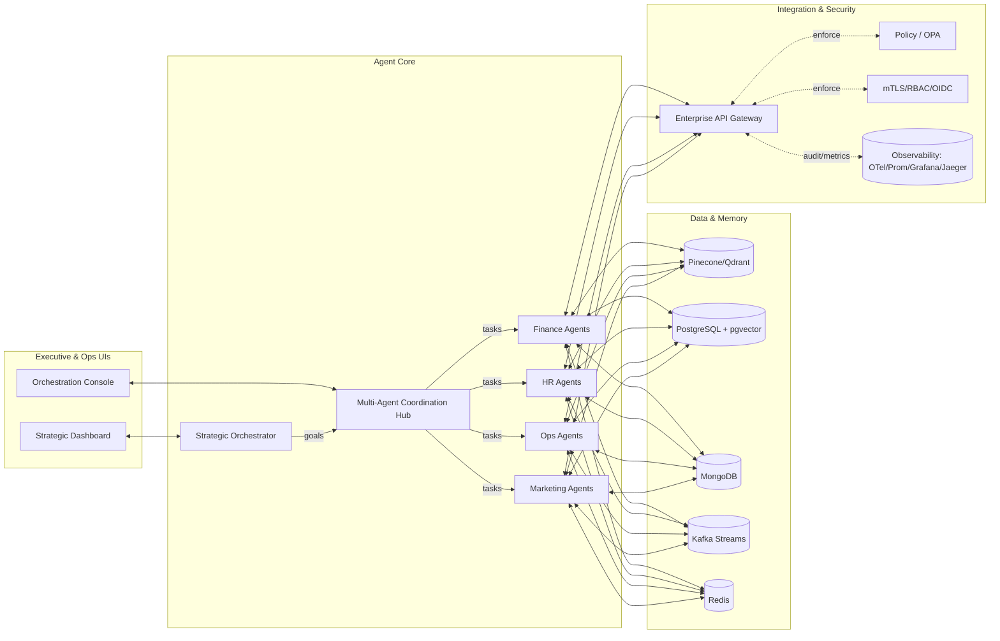

# Autonomous Level-5 Company

> Enterprise-grade, multi-agent AI platform for end-to-end autonomous operations (strategy → execution → learning).  
> Built around hierarchical agents, real-time data, rigorous governance, and cloud-native reliability.

<p align="center">
  <a href="#"></a>
  <a href="#"></a>
  <a href="#"></a>
</p>

---

## ✨ What it is

An agent-first platform that lets organizations run core functions with autonomous AI:

- **Strategic Orchestrator** — plans goals, aligns initiatives, and allocates resources.
- **Coordination Hub** — routes tasks, balances load, and manages agent lifecycles.
- **Domain Agent Clusters** — Finance, HR, Operations, Marketing, etc.
- **Enterprise Integration Gateway** — secure APIs, identity, rate limiting, audit.
- **Learning Loop** — continuous evaluation, telemetry, and optimization.

Target outcomes: **20–30% productivity gains**, **24/7 decisioning**, and **>85% autonomous decisions** in scoped domains.

---

## 🧭 Core Capabilities

- **Autonomous decisioning** with human-in-the-loop for high-risk edges  
- **Multi-agent orchestration** (sequential, concurrent, group chat, dynamic handoff)  
- **Real-time processing** (sub-second reactions on event streams)  
- **Observability by design** (OpenTelemetry GenAI, Prometheus, Jaeger)  
- **Zero-trust security** (RBAC, mTLS, policy enforcement, full audit)  
- **Hybrid vector memory** (Pinecone/Qdrant + pgvector)  
- **Agent identity & governance** (OIDC/SSO, policy, audit, RTO/RPO)  

---

## 🏗️ High-Level Architecture



Architectural patterns: **hierarchical autonomy**, **event-driven comms**, **agent-as-microservice**, **GitOps**.

---

## 🚀 Quickstart (Dev)

> Prereqs: Docker, Python 3.12+, Node 20+, Poetry, pnpm/npm

```bash
# 1) Clone
git clone <your-repo> && cd <your-repo>

# 2) Backend: agents & APIs
cd services/backend
poetry install
poetry run uvicorn app.main:app --reload

# 3) Frontend: dashboards
cd ../../apps/web
pnpm i
pnpm dev

# 4) Local stack (optional)
cd ../../infra/compose
docker compose up -d  # postgres, redis, qdrant, kafka, jaeger, prometheus, grafana
```

**Default services (dev):**
- FastAPI (Agents/API) → `http://localhost:8000`
- Web (Next.js) → `http://localhost:3000`
- Grafana → `http://localhost:3001` (admin/admin)
- Jaeger → `http://localhost:16686`
- Qdrant → `http://localhost:6333`

---

## 🧰 Tech Stack (selected)

- **Agents & Orchestration:** LangGraph / CrewAI / AutoGen; Python 3.12  
- **APIs:** FastAPI, Pydantic v2, Uvicorn  
- **Vector & Data:** Pinecone or Qdrant, PostgreSQL + pgvector, Redis, Kafka  
- **UI:** Next.js 15, React 18, Tailwind, React Query, Recharts  
- **Obs:** OpenTelemetry, Prometheus, Grafana, Jaeger  
- **Security:** OIDC/SSO, RBAC, mTLS, OPA/Gatekeeper  
- **Containers/Cloud:** Docker, Kubernetes, Helm, ArgoCD, Terraform  

---

## 📦 Repository Layout

```
.
├─ apps/
│  └─ web/                 # Next.js dashboards (exec, ops, domain)
├─ services/
│  ├─ backend/             # FastAPI app (agents, orchestration, gateway)
│  ├─ agents/              # Agent packages (strategic, domain, tools)
│  └─ workers/             # Stream processors, schedulers
├─ infra/
│  ├─ helm/                # Charts (core, domain, gateway, obs)
│  ├─ terraform/           # Cloud infra (AKS/EKS/GKE, networking, secrets)
│  └─ compose/             # Dev docker-compose
├─ ops/
│  ├─ policies/            # OPA policies, RBAC, network policies
│  ├─ runbooks/            # Incident response & SRE playbooks
│  └─ dashboards/          # Grafana/OTel configs
└─ docs/                   # ADRs, architecture, APIs, governance
```

---

## 🔐 Security & Compliance

- **Zero-Trust** (least privilege, short-lived creds, JIT tokens)  
- **Defense-in-depth** (WAF, API gateway, rate limiting, schema validation)  
- **Auditability** (tamper-proof decision logs, full traces, 7-year retention options)  
- **Privacy** (encryption in transit & at rest, masking, k-anonymity for analytics)  
- **SLA/Resilience**: 99.9–99.99% targets, blue/green + canary, RTO 15m / RPO 5m  
- **Regulatory**: GDPR / SOC2 / ISO27001 alignment, EU AI Act readiness  

---

## 📈 Observability (GenAI-aware)

- **Metrics:** latency, token usage, decision accuracy, task success, cost  
- **Traces:** per-decision spans (planning → tools → integrations)  
- **Logs:** structured agent decisions, policy verdicts, escalations  
- Dashboards for **exec KPIs**, **ops health**, **security posture**  

---

## 🛠️ Development Scripts

```bash
# Type checks & lint
poetry run ruff check . && poetry run mypy services

# Tests
poetry run pytest -q

# Load testing (Locust demo)
poetry run locust -f ops/perf/locustfile.py

# Seed vector stores in dev
python ops/tools/seed_memory.py --qdrant --pgvector
```

---

## 🔄 CI/CD (example)

- **CI:** lint → unit → integration → security scans → build images → push  
- **CD:** GitOps via ArgoCD; **canary** (5 → 25 → 50 → 100) with auto-rollback on:
  - error rate > 5% or p95 latency 2× baseline
  - policy violations / auth failures
  - KPI regressions beyond thresholds  

---

## 📚 API Surface (sketch)

- `POST /strategic/plan` — propose & align goals  
- `POST /orchestrate/task` — route task to optimal agent(s)  
- `POST /integrations/call` — signed, policy-checked enterprise API call  
- `GET /telemetry/*` — metrics, traces, decision logs (scoped/RBAC)  
- `POST /guardrails/evaluate` — prompt & action safety checks  
(See OpenAPI in `services/backend/app/openapi.json`)

---

## 🗺️ Roadmap

- [ ] Managed agent identities (OIDC Agent ID) end-to-end  
- [ ] A2A & MCP protocol adapters GA  
- [ ] Cost-aware planner for cross-cloud inference  
- [ ] RAG pipelines per domain with evaluators  
- [ ] Red-team harness & adversarial testing suite  
- [ ] UI “thought log” with layered explanations  

---

## 🤝 Contributing

1. Read `docs/contributing.md` & `docs/architecture/adr-*`  
2. Open a draft PR early; we practice **“docs-first”** for new capabilities  
3. Add tests, OTel spans, and update dashboards for new services  
4. Run `make verify` before pushing

---

## 📄 License

Apache-2.0 (see `LICENSE`)

---

## Acknowledgments

This implementation is distilled from the **Technical Specifications: Autonomous Level-5 Company** (2025). For the full rationale, KPIs, SLAs, security controls, testing strategy, and diagrams, see the original specification.
